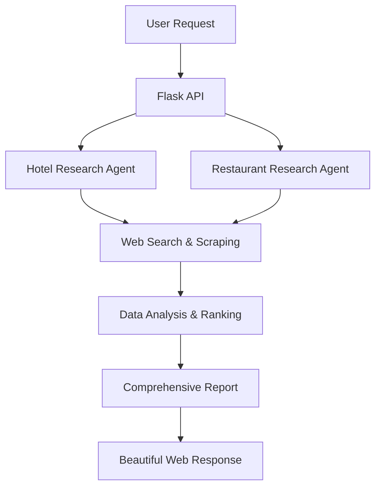

# 🏨 Hotel & Restaurant AI Research Agent

<div align="center">


**A sophisticated AI-powered web application that leverages intelligent agents to research and recommend the best hotels and restaurants in any city worldwide.**

[Features](#-features) • [Quick Start](#-quick-start) • [Docker Setup](#-docker-deployment) • [API Documentation](#-api-usage) • [Configuration](#-configuration)

</div>

---

## 🌟 Features

### 🤖 **AI-Powered Research Agents**
- **Hotel Research Agent**: Analyzes accommodations based on reviews, ratings, location, and value
- **Restaurant Discovery Agent**: Evaluates dining options considering cuisine, ambiance, and customer feedback
- **Intelligent Web Scraping**: Real-time data collection from multiple sources

### 🎯 **Comprehensive Analysis**
- ✅ **Multi-factor Evaluation**: Reviews, ratings, pricing, location, amenities
- ✅ **Real-time Data**: Fresh information from current web sources
- ✅ **Detailed Reports**: In-depth analysis with actionable recommendations
- ✅ **Global Coverage**: Research any city worldwide

### 🌐 **Production-Ready Architecture**
- ✅ **Containerized Deployment**: Docker & Docker Compose ready
- ✅ **Scalable Design**: Microservices architecture with health checks
- ✅ **RESTful API**: Clean JSON endpoints for integration
- ✅ **Beautiful Web Interface**: Responsive, modern UI
- ✅ **Cloud Deployment Ready**: Heroku, AWS, GCP, Azure compatible

---

## 🚀 Quick Start

### Prerequisites

Before you begin, ensure you have:

- **Python 3.11+** installed
- **Docker & Docker Compose** (recommended)
- **OpenAI API Key** ([Get it here](https://platform.openai.com/api-keys))
- **Serper API Key** ([Get it here](https://serper.dev/api-key))

### 🏃‍♂️ 1-Minute Setup

```bash
# 1. Clone the repository
git clone <your-repository-url>
cd hotel-restaurant-ai-agent

# 2. Set up environment variables
cp .env.template .env
# Edit .env and add your API keys

# 3. Run with Docker (recommended)
docker-compose up --build

# 4. Open your browser
# Visit: http://localhost:5000
```

**That's it! 🎉** Your AI research agent is now running.

---

## 🐳 Docker Deployment

### Using Docker Compose (Recommended)

```bash
# Standard deployment
docker-compose up -d

# With nginx reverse proxy
docker-compose --profile with-nginx up -d

# View logs
docker-compose logs -f hotel-booking-app
```

### Manual Docker Build

```bash
# Build the image
docker build -t hotel-ai-agent .

# Run the container
docker run -p 5000:5000 --env-file .env hotel-ai-agent
```

### Docker Commands Reference

```bash
# Stop services
docker-compose down

# Rebuild from scratch
docker-compose build --no-cache

# Scale the application
docker-compose up --scale hotel-booking-app=3

# Clean up everything
docker-compose down --rmi all --volumes
```

---

## 🏗️ Project Structure

```
hotel-restaurant-ai-agent/
├── 📁 Application Core
│   ├── hotel_booking_app.py      # Main Flask application
│   ├── requirements.txt          # Python dependencies
│   └── templates/
│       └── index.html           # Beautiful web interface
│
├── 🐳 Docker Configuration
│   ├── Dockerfile               # Container definition
│   ├── docker-compose.yml       # Multi-service orchestration
│   └── .dockerignore           # Docker build exclusions
│
├── ⚙️ Configuration
│   ├── .env.template           # Environment variables template
│   ├── .env                    # Your API keys (create this)
│   └── README.md              # This file
│
└── 📊 Runtime
    └── logs/                   # Application logs
```

---

## 🔧 Configuration

### Environment Variables

Create a `.env` file with your API credentials:

```bash
# Required API Keys
OPENAI_API_KEY=sk-your-openai-key-here
SERPER_API_KEY=your-serper-key-here

# Application Settings
FLASK_ENV=production
FLASK_DEBUG=False
PORT=5000

# Optional: Enhanced Logging
LOG_LEVEL=INFO
```

### Getting API Keys

#### 🔑 OpenAI API Key
1. Visit [OpenAI Platform](https://platform.openai.com/api-keys)
2. Create account or sign in
3. Generate new API key
4. Add to `.env` file

#### 🔍 Serper API Key  
1. Visit [Serper.dev](https://serper.dev/api-key)
2. Sign up with Google
3. Copy your API key
4. Add to `.env` file

---

## 📡 API Usage

### Research Endpoint

**POST** `/research`

Analyze hotels and restaurants for any city.

```bash
curl -X POST http://localhost:5000/research \
  -H "Content-Type: application/json" \
  -d '{"city": "Tokyo"}'
```

**Request Body:**
```json
{
  "city": "Tokyo"
}
```

**Response:**
```json
{
  "status": "success",
  "city": "Tokyo",
  "results": "## Top 5 Hotels in Tokyo\n\n1. **Park Hyatt Tokyo**\n   - Location: Shinjuku...",
  "message": "Successfully found recommendations for Tokyo"
}
```

### Health Check

**GET** `/health`

Monitor application status.

```bash
curl http://localhost:5000/health
```

**Response:**
```json
{
  "status": "healthy",
  "service": "Hotel Booking Agent API",
  "version": "1.0.0"
}
```

---

## 🌐 Web Interface

### Beautiful, Responsive Design

The application includes a stunning web interface featuring:

- **🎨 Modern UI**: Gradient backgrounds, smooth animations
- **📱 Mobile-Friendly**: Responsive design for all devices  
- **⚡ Real-time Updates**: Loading states and progress indicators
- **🔍 Intelligent Search**: City name autocomplete and validation
- **📊 Rich Results**: Formatted research reports with detailed insights

### Using the Web Interface

1. **Open your browser** → `http://localhost:5000`
2. **Enter a city name** → e.g., "Paris", "New York", "Tokyo"
3. **Click Search** → AI agents begin research
4. **Wait 2-3 minutes** → Comprehensive analysis in progress
5. **View Results** → Detailed recommendations appear

---

## 🏭 Production Deployment

### Heroku Deployment

```bash
# Install Heroku CLI and login
heroku login

# Create new app
heroku create your-app-name

# Set environment variables
heroku config:set OPENAI_API_KEY=your_key
heroku config:set SERPER_API_KEY=your_key

# Deploy
git push heroku main

# Open your app
heroku open
```

### AWS/GCP/Azure

The application is fully containerized and ready for cloud deployment:

- **AWS**: ECS, Fargate, or Elastic Beanstalk
- **Google Cloud**: Cloud Run or GKE
- **Azure**: Container Instances or AKS

### Environment-Specific Configurations

```yaml
# docker-compose.prod.yml
services:
  hotel-booking-app:
    build: .
    environment:
      - FLASK_ENV=production
      - WORKERS=4
    deploy:
      replicas: 3
      resources:
        limits:
          memory: 1G
```

---

## 🧠 How It Works

### AI Agent Architecture



### Research Process

1. **🎯 Query Processing**: City validation and query optimization
2. **🤖 Agent Deployment**: Parallel execution of specialized AI agents
3. **🔍 Data Collection**: Real-time web scraping and API calls
4. **📊 Analysis Engine**: Multi-factor scoring and ranking algorithms  
5. **📝 Report Generation**: Structured, readable recommendations
6. **🎨 Response Formatting**: Beautiful presentation layer

### Agent Capabilities

#### 🏨 Hotel Research Agent
- Reviews analysis from multiple platforms
- Price comparison and value assessment
- Location and accessibility evaluation
- Amenities and service quality scoring

#### 🍽️ Restaurant Research Agent  
- Cuisine type and quality analysis
- Ambiance and dining experience evaluation
- Price range and value proposition
- Local favorites vs. tourist destinations

---

## ⚡ Performance & Scaling

### Response Times
- **Simple queries**: 30-60 seconds
- **Complex analysis**: 2-3 minutes
- **Concurrent requests**: Supported with worker scaling

### Optimization Features
- **Docker multi-stage builds** for smaller images
- **Gunicorn workers** for request handling
- **Health checks** for reliability
- **Log aggregation** for monitoring
- **Graceful shutdowns** for zero-downtime deployments

### Scaling Configuration

```bash
# Scale horizontally
docker-compose up --scale hotel-booking-app=5

# Monitor resource usage
docker stats

# View application metrics
curl http://localhost:5000/metrics
```

---

## 🛠️ Development

### Local Development Setup

```bash
# Create virtual environment
python -m venv venv
source venv/bin/activate  # Windows: venv\Scripts\activate

# Install dependencies
pip install -r requirements.txt

# Run in development mode
export FLASK_DEBUG=True
python hotel_booking_app.py
```

### Testing

```bash
# Run health check
curl http://localhost:5000/health

# Test city research
curl -X POST http://localhost:5000/research \
  -H "Content-Type: application/json" \
  -d '{"city": "San Francisco"}'

# View logs
tail -f logs/app.log
```

### Code Quality

```bash
# Format code
black hotel_booking_app.py

# Lint code  
flake8 hotel_booking_app.py

# Run tests
pytest tests/
```

---

## 🔒 Security & Best Practices

### Security Features
- ✅ **Environment variable management** for API keys
- ✅ **Input validation** and sanitization
- ✅ **Rate limiting** protection
- ✅ **Non-root container user** for security
- ✅ **CORS protection** enabled
- ✅ **Health check endpoints** for monitoring

### Production Checklist
- [ ] Set `FLASK_ENV=production`
- [ ] Use strong API keys
- [ ] Enable HTTPS/SSL
- [ ] Configure log rotation
- [ ] Set up monitoring alerts
- [ ] Implement backup strategies

---

## 🐛 Troubleshooting

### Common Issues & Solutions

#### 🔴 "ModuleNotFoundError: No module named 'app'"
**Solution**: Ensure your main file is named `hotel_booking_app.py` and Dockerfile references it correctly.

#### 🔴 "API Key Error" 
**Solution**: Check your `.env` file has valid API keys without extra spaces.

```bash
# Correct format
OPENAI_API_KEY=sk-your-key-here
# Wrong format  
OPENAI_API_KEY = sk-your-key-here
```

#### 🔴 "Port 5000 already in use"
**Solution**: Change the port in docker-compose.yml:

```yaml
ports:
  - "8080:5000"  # Use port 8080 instead
```

#### 🔴 Docker build fails
**Solution**: Clean Docker cache and rebuild:

```bash
docker system prune -a
docker-compose build --no-cache
```

### Debug Commands

```bash
# Check container logs
docker-compose logs -f hotel-booking-app

# Inspect running container
docker exec -it <container-id> /bin/bash

# Check file structure inside container
docker run --rm <image-name> ls -la /app/

# Test API endpoints
curl -v http://localhost:5000/health
```

---

## 🤝 Contributing

We welcome contributions! Here's how to get started:

### Development Workflow

1. **Fork the repository**
2. **Create feature branch**: `git checkout -b feature/amazing-feature`
3. **Make changes and test thoroughly**
4. **Commit with clear messages**: `git commit -m 'Add amazing feature'`
5. **Push to your fork**: `git push origin feature/amazing-feature` 
6. **Open Pull Request** with detailed description

### Code Standards

- Follow PEP 8 Python style guidelines
- Add docstrings to all functions
- Include type hints where possible
- Write tests for new features
- Update documentation as needed

---

## 📈 Roadmap

### Upcoming Features
- 🚀 **Multi-language support** (Spanish, French, Japanese)
- 🎯 **Advanced filtering options** (budget, cuisine type, ratings)
- 📱 **Mobile app** (React Native)
- 🧠 **Machine learning recommendations** based on user preferences
- 🗺️ **Interactive maps** with location visualization  
- 💬 **Chat interface** for conversational queries
- 📊 **Analytics dashboard** for usage insights

### Integration Possibilities
- **Booking APIs**: Expedia, Booking.com integration
- **Social Media**: Instagram/TikTok reviews analysis
- **Travel Platforms**: TripAdvisor, Yelp data integration
- **Payment Systems**: Stripe for booking capabilities

---

## 📄 License

This project is licensed under the MIT License - see the [LICENSE](LICENSE) file for details.

```
MIT License

Copyright (c) 2025 Hotel & Restaurant AI Research Agent

Permission is hereby granted, free of charge, to any person obtaining a copy
of this software and associated documentation files (the "Software"), to deal
in the Software without restriction, including without limitation the rights
to use, copy, modify, merge, publish, distribute, sublicense, and/or sell
copies of the Software...
```

---

## 🙏 Acknowledgments

### Technologies Used
- **[CrewAI](https://github.com/joaomdmoura/crewai)** - Multi-agent AI framework
- **[Flask](https://flask.palletsprojects.com/)** - Web framework
- **[OpenAI](https://openai.com/)** - Language model capabilities
- **[Serper](https://serper.dev/)** - Web search API
- **[Docker](https://www.docker.com/)** - Containerization platform

### Special Thanks
- OpenAI team for advancing AI accessibility
- CrewAI community for the excellent framework
- All contributors and beta testers
- The open-source community

---

## 📞 Support & Contact

### Get Help
- 📖 **Documentation**: Read this README thoroughly
- 🐛 **Bug Reports**: Open an issue on GitHub
- 💡 **Feature Requests**: Start a discussion
- 💬 **Community**: Join our Discord server

### Professional Support
For enterprise deployments, custom integrations, or professional support:
- 📧 **Email**: support@hotelai-agent.com
- 🌐 **Website**: www.hotelai-agent.com
- 💼 **LinkedIn**: [Company Profile]

---

<div align="center">

### 🌟 **Star this repository if you found it helpful!** 🌟

**Made with ❤️ by developers who love to travel**

[⬆ Back to Top](#-hotel--restaurant-ai-research-agent)

</div>